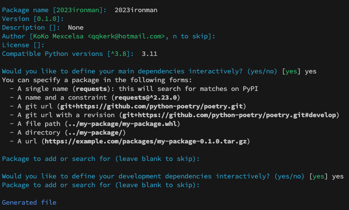
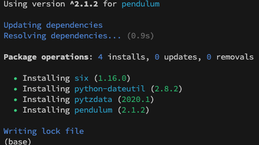

# [全端 LLM 應用開發-Day03-Poetry 入門](https://ithelp.ithome.com.tw/m/articles/10322014)

昨天我們使用 Virtualenv 來建立 Python 虛擬環境, 並使用 pip 來安裝套件. 但是, 它們也有一些局限性和缺點, 其中最大的問題是套件的相依性. `pip` 在解決套件之間的版本衝突時很容會遇到困難. 它不具備先進的依賴解析算法, 這可能導致不穩定的環境和不可預知的錯誤. 更重要的是, 移除套件時, `pip` 只會移除一個該套件, 而不會移除其他相依的套件. 也因此發展出針對套件相依性更好的工具, 例如說 `pipenv` 與今天的主角 `poetry`.

Pipenv 曾經因為一些歷史因素, 導致其發展停滯不前. 雖然這幾年表現就有比較好了, 但是這幾年的時間我已經改用 Poetry 了, 而且體感上真的好非常多. 以下我們就來介紹 Poetry 吧!

Poetry 是一個現代化的套件管理工具, 它不僅可以幫助我們管理套件的依賴, 還提供了一個虛擬環境的解決方案. Poetry 使用一個 toml 檔 `pyproject.toml` 文件來管理專案配置和依賴, 這符合 – Specifying Minimum Build System Requirements for Python Projects 所提倡的現代 Python 專案的依賴項管理. 我們馬上使用 poetry 吧!

1. 安裝:
   在 Linux, macOS, Windows (WSL) 使用以下指令. 需注意電腦上要有 Python 3.8+.
   `curl -sSL https://install.python-poetry.org | python3 -`

2. 檢查是否安裝成功.
   `poetry --version`
   會輸出你安裝的版本, 筆者寫文時為 `Poetry (version 1.6.1)`

3. 接著我們可以使用指令 `poetry config --list` 來看到 poetry 的一些設定, 大致會如下面的輸出.

```bash
cache-dir = "/your/path/to/pypoetry"
experimental.system-git-client = false
installer.max-workers = null
installer.modern-installation = true
installer.no-binary = null
installer.parallel = true
virtualenvs.create = true
virtualenvs.in-project = false
virtualenvs.options.always-copy = false
virtualenvs.options.no-pip = false
virtualenvs.options.no-setuptools = false
virtualenvs.options.system-site-packages = false
virtualenvs.path = "{cache-dir}/virtualenvs"  # /your/path/to/pypoetry/Caches/pypoetry/virtualenvs
virtualenvs.prefer-active-python = false
virtualenvs.prompt = "{project_name}-py{python_version}"
```

其中我們會看到 virtualenvs.in-project 這個選項是 false. 昨天有提到我們習慣讓虛擬環境在專案中, 因為是 Python 專案往往是高度依賴虛擬環境的.

4. 使用下面的指令, 設定虛擬環境到專案資料夾中:
   `poetry config virtualenvs.in-project true`

5. 接著我們用 poetry 新建一個專案: `poetry new day03`, 然後 `cd day03`.

```bash
day03
  |-- __init__.py
tests
  |-- __init__.py
pyproject.toml
README.txt
```

6. 接著我們使用 `poetry init`, 會出現類似下圖的步驟, 我們就依提示完成.



7. 我們會看到預設是 pyproject.toml 裡的 python 版本是 3.8 相容, 我們改成 3.11. 如下所示:

```toml
[tool.poetry.dependencies]
python = "^3.11"
```

8. 接著使用 `poetry install`, 就會看到類似下面的資訊. 同時也會自動幫我們新增一個 .venv 的資料夾.

```bash
Using python3 (3.11.5)
Creating virtualenv day03 in /Users/koko/Desktop/programming/2023ironman/day03/.venv
Updating dependencies
Resolving dependencies... (0.1s)
```

9. 接著使用 `poetry run python --version`, 就會看到 python 版本是 3.11.5 了!

10. 接著我們來安裝 package, 使用 `poetry add pendulum`, 這是 python 一個 datetime 的工具. 我們可以看到 poetry 自動幫我們解析好依賴了, 如下圖所示:



11. 此時也看到 toml 檔裡多了一個 `pendulum = "^2.1.2"`.  Poetry.Lock 裡也會看到多了 pendulum 的資訊了.

12. 接著我們新增一個 main.py

```python
import pendulum
import sys

print("Hello World!")
print(sys.version)
print(pendulum.now())
```

13. 跑這個 main.py: `poetry run python day03/main.py`
    會得到類似下面的資訊:

```bash
Hello World!
3.11.5 (v3.11.5:cce6ba91b3, Aug 24 2023, 10:50:31) [Clang 13.0.0 (clang-1300.0.29.30)]
2023-09-18T23:44:16.002581+08:00
```

至此就成功了, 可以看到我真的沒有存稿件, 是寶寶睡了的晚上就開始寫文章😂😂

以上就是 poetry 的虛擬環境安裝了, 明天我們會更進一步詳解 pyproject.toml.