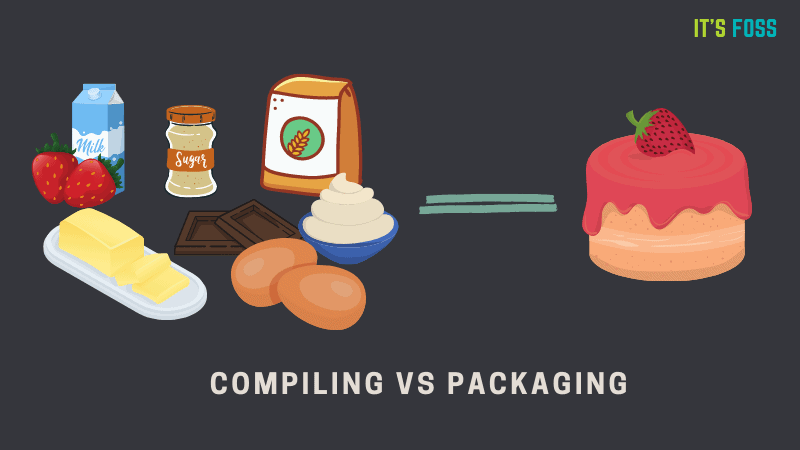
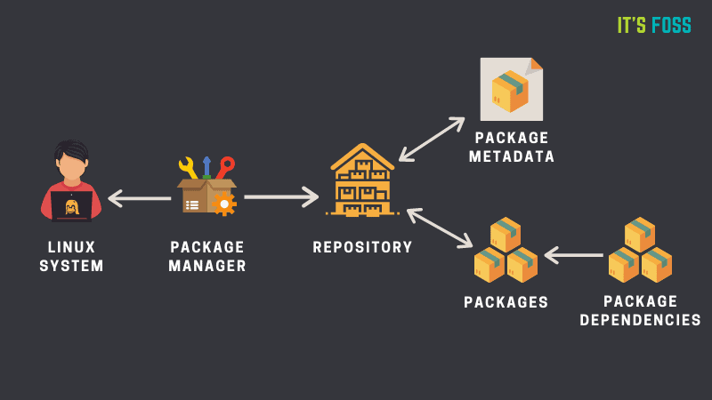
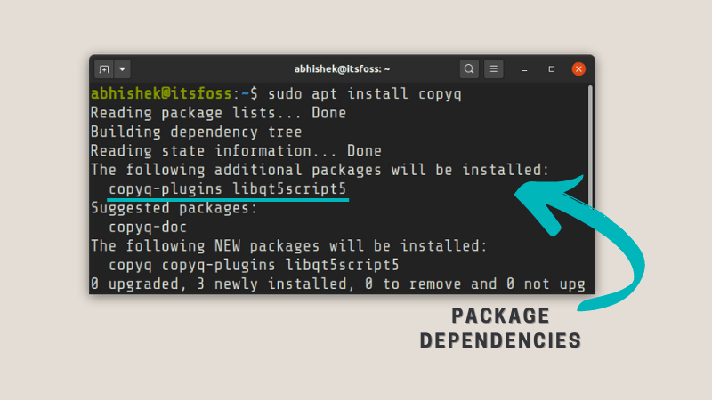

# Linux Jargon Buster: What is a Package Manager in Linux? How Does it Work?
Linux 术语解释: Linux 中的包管理器是什么? 它是如何工作的?

* https://itsfoss.com/package-manager/

Learn about packaging system and package managers in Linux. You'll learn how do they work and what kind of package managers available.
了解 Linux 中的软件包系统和软件包管理器. 您将了解它们的工作原理以及可用的软件包管理器类型.

One of the main points [how Linux distributions differ from each other](https://itsfoss.com/what-is-linux/) is the package management. In this part of the Linux jargon buster series, you'll learn about packaging and package managers in Linux. You'll learn what are packages, what are package managers and how do they work and what kind of package managers available.
[Linux 发行版之间的](https://itsfoss.com/what-is-linux/)主要区别之一在于软件包管理. 在本篇 Linux 术语讲解系列文章中, 您将学习 Linux 中的软件包和软件包管理器. 您将了解什么是软件包、什么是软件包管理器、它们的工作原理以及有哪些类型的软件包管理器.

## What is a package manager in Linux?
Linux 中的包管理器是什么?

In simpler words, a package manager is a tool that allows users to install, remove, upgrade, configure and manage software packages on an operating system. The package manager can be a graphical application like a software center or a command line tool like [apt-get](https://itsfoss.com/apt-vs-apt-get-difference/) or [pacman](https://itsfoss.com/pacman-command/).
简单来说, 软件包管理器是一种允许用户在操作系统上安装、删除、升级、配置和管理软件包的工具. 软件包管理器可以是像软件中心这样的图形化应用程序, 也可以是像 [apt-get](https://itsfoss.com/apt-vs-apt-get-difference/) 或 [pacman](https://itsfoss.com/pacman-command/) 这样的命令行工具.

You'll often find me using the term 'package' in tutorials and articles on It's FOSS. To understand package manager, you must understand what a package is.
在 It's FOSS 的教程和文章中, 你经常会看到我使用"包"这个词. 要理解包管理器, 你必须先理解什么是包.

## What is a package?
什么是包裹?

A package is usually referred to an application but it could be a GUI application, command line tool or a software library (required by other software programs). A package is essentially an archive file containing the binary executable, configuration file and sometimes information about the dependencies.
软件包通常指的是应用程序, 但也可能是图形用户界面应用程序、命令行工具或软件库(其他软件程序所需的库). 软件包本质上是一个归档文件, 其中包含二进制可执行文件、配置文件, 有时还包含依赖项信息.

In older days, [software used to installed from its source code](https://itsfoss.com/install-software-from-source-code/). You would refer to a file (usually named readme) and see what software components it needs, location of binaries. A configure script or makefile is often included. You will have to compile the software or on your own along with handling all the dependencies (some software require installation of other software) on your own.
以前, [软件都是从源代码安装的](https://itsfoss.com/install-software-from-source-code/). 你需要查阅一个文件(通常名为 readme), 了解它需要哪些软件组件以及二进制文件的位置. 通常还会包含一个 configure 脚本或 Makefile 文件. 你需要自行编译软件, 并自行处理所有依赖项(有些软件需要安装其他软件).

To get rid of this complexity, Linux distributions created their own packaging format to provide the end users ready-to-use binary files (precompiled software) for installing software along with some [metadata](https://www.computerhope.com/jargon/m/metadata.htm?ref=itsfoss.com) (version number, description) and dependencies.
为了消除这种复杂性, Linux 发行版创建了自己的打包格式, 为最终用户提供可直接使用的二进制文件(预编译软件)来安装软件, 以及一些[元数据](https://www.computerhope.com/jargon/m/metadata.htm?ref=itsfoss.com) (版本号、描述)和依赖项.

It is like baking a cake versus buying a cake.
这就像自己烤蛋糕和买蛋糕的区别一样.

Around mid 90s, Debian created .deb or DEB packaging format and Red Hat Linux created .rpm or RPM (short for Red Hat Package Manager) packaging system. Compiling source code still exists but it is optional now.
大约在 20 世纪 90 年代中期, Debian 创建了 .deb 或 DEB 软件包格式, 而 Red Hat Linux 创建了 .rpm 或 RPM(Red Hat Package Manager 的缩写)软件包系统. 编译源代码仍然存在, 但现在是可选的.

To interact with or use the packaging systems, you need a package manager.
要与包装系统进行交互或使用包装系统, 您需要一个包装管理器.

## How does the package manager work?
包管理器的工作原理是什么?

Please keep in mind that package manager is a generic concept and it's not exclusive to Linux. You'll often find package manager for different software or programming languages. There is [PIP package manager just for Python packages](https://itsfoss.com/install-pip-ubuntu/). Even [Atom editor has its own package manager](https://itsfoss.com/install-packages-in-atom/).
请记住, 包管理器是一个通用概念, 并非 Linux 独有. 您经常会发现各种软件或编程语言都有自己的包管理器. [例如, Python 就有专门的包管理器 PIP](https://itsfoss.com/install-pip-ubuntu/). 甚至 [Atom 编辑器也有自己的包管理器](https://itsfoss.com/install-packages-in-atom/).

Since the focus in this article is on Linux, I'll take things from Linux's perspective. However, most of the explanation here could be applied to package manager in general as well.
由于本文重点在于 Linux, 我将从 Linux 的角度进行阐述. 不过, 这里的大部分解释也适用于一般的包管理器.

I have created this diagram (based on SUSE Wiki) so that you can easily understand how a package manager works.
我根据 SUSE Wiki 创建了这个图表, 以便您能够轻松理解软件包管理器的工作原理.

Almost all Linux distributions have software repositories which is basically collection of software packages. Yes, there could be more than one repository. The repositories contain software packages of different kind.
几乎所有 Linux 发行版都有软件仓库, 它本质上是软件包的集合. 是的, 可能存在多个仓库. 这些仓库包含各种类型的软件包.

Repositories also have metadata files that contain information about the packages such as the name of the package, version number, description of package and the repository name etc. This is what you see if you use the [apt show command](https://itsfoss.com/apt-search-command/) in Ubuntu/Debian.
软件仓库还包含元数据文件, 其中包含有关软件包的信息, 例如软件包名称、版本号、软件包描述和软件仓库名称等. 如果您在 Ubuntu/Debian 中使用 [apt show 命令](https://itsfoss.com/apt-search-command/) 就会看到这些信息.

Your system's package manager first interacts with the metadata. The package manager creates a local cache of metadata on your system. When you run the update option of the package manager (for example apt update), it updates this local cache of metadata by referring to metadata from the repository.
系统的软件包管理器首先会与元数据交互. 软件包管理器会在系统上创建一个本地元数据缓存. 当您运行软件包管理器的更新选项(例如 `apt update`)时, 它会通过引用软件仓库中的元数据来更新此本地元数据缓存

When you run the installation command of your package manager (for example apt install package_name), the package manager refers to this cache. If it finds the package information in the cache, it uses the internet connection to connect to the appropriate repository and downloads the package first before installing on your system.
当您运行软件包管理器的安装命令(例如 `apt install package_name`)时, 软件包管理器会参考此缓存. 如果它在缓存中找到软件包信息, 则会使用网络连接连接到相应的软件仓库, 并先下载软件包, 然后再将其安装到您的系统上.

A package may have dependencies. Meaning that it may require other packages to be installed. The package manager often takes care of the dependencies and installs it automatically along with the package you are installing.
一个软件包可能存在依赖关系, 这意味着它可能需要安装其他软件包. 软件包管理器通常会处理这些依赖关系, 并将它们与您正在安装的软件包一起自动安装.

Similarly, when you remove a package using the package manager, it either automatically removes or informs you that your system has unused packages that can be cleaned.
同样, 当您使用软件包管理器删除软件包时, 它要么自动删除软件包, 要么通知您系统中存在可以清理的未使用软件包.

Apart from the obvious tasks of installing, removing, you can use the package manager to configure the packages and manage them as per your need. For example, you can [prevent the upgrade of a package version](https://itsfoss.com/prevent-package-update-ubuntu/) from the regular system updates. There are many more things your package manager might be capable of.
除了安装和卸载这些显而易见的任务之外, 您还可以使用软件包管理器来配置软件包并根据需要进行管理. 例如, 您可以[阻止某个软件包版本随常规系统更新而升级](https://itsfoss.com/prevent-package-update-ubuntu/). 软件包管理器还有许多其他功能.

## Different kinds of package managers
不同类型的软件包管理器

Package Managers differ based on packaging system but same packaging system may have more than one package manager.
不同的打包系统使用不同的打包管理器, 但同一个打包系统可能对应多个打包管理器.

For example, RPM has [Yum](https://fedoraproject.org/wiki/Yum?ref=itsfoss.com) and [DNF](https://fedoraproject.org/wiki/DNF?ref=itsfoss.com) package managers. For DEB, you have apt-get, [aptitude](https://wiki.debian.org/Aptitude?ref=itsfoss.com) command line based package managers.
例如, RPM 有 [Yum](https://fedoraproject.org/wiki/Yum?ref=itsfoss.com) 和 [DNF](https://fedoraproject.org/wiki/DNF?ref=itsfoss.com) 包管理器. DEB 则有 apt-get 和 [aptitude](https://wiki.debian.org/Aptitude?ref=itsfoss.com) 等基于命令行的包管理器.

Package managers are not necessarily command line based. You have graphical package managing tools like [Synaptic](https://itsfoss.com/synaptic-package-manager/). Your distribution's software center is also a package manager even if it runs apt-get or DNF underneath.
软件包管理器不一定是基于命令行的. 您可以使用图形化的软件包管理工具, 例如 [Synaptic](https://itsfoss.com/synaptic-package-manager/). 即使您的发行版软件中心底层运行的是 apt-get 或 DNF, 它本身也是一个软件包管理器.

## Conclusion
结论

I don't want to go in further detail on this topic because I can go on and on. But it will deviate from the objective of the topic which is to give you a basic understanding of package manager in Linux.
我不想在这个话题上展开过多讨论, 因为我可以一直讲下去. 但这会偏离本文的主题, 本文的目的是让大家对 Linux 中的包管理器有一个基本的了解.

I have omitted the new universal packaging formats like Snap and Flatpak for now.
我暂时省略了像 Snap 和 Flatpak 这样的新型通用包装形式.

I do hope that you have a bit better understanding of the package management system in Linux. If you are still confused or if you have some questions on this topic, please use the comment system. I'll try to answer your questions and if required, update this article with new points.
我希望您对 Linux 的软件包管理系统有了更深入的了解. 如果您仍有疑问或对这个主题有任何疑问, 请使用评论系统. 我会尽力解答您的问题, 并在必要时更新本文, 添加新的内容.
