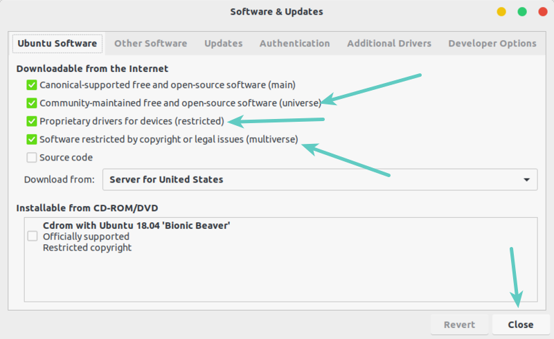
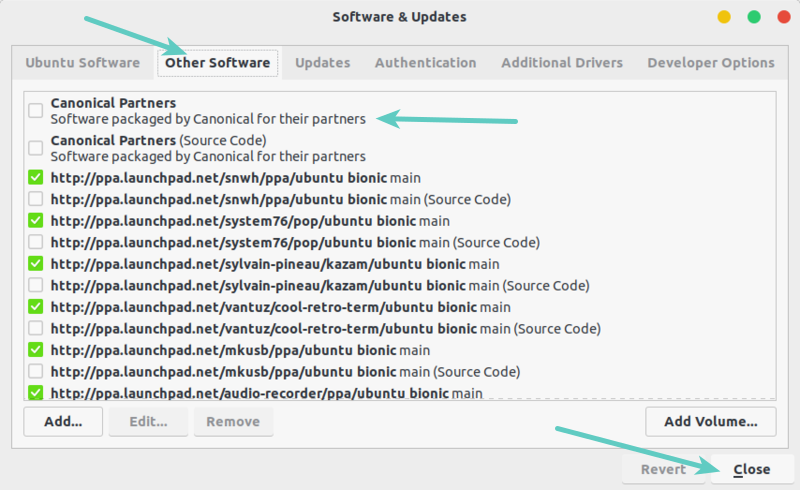
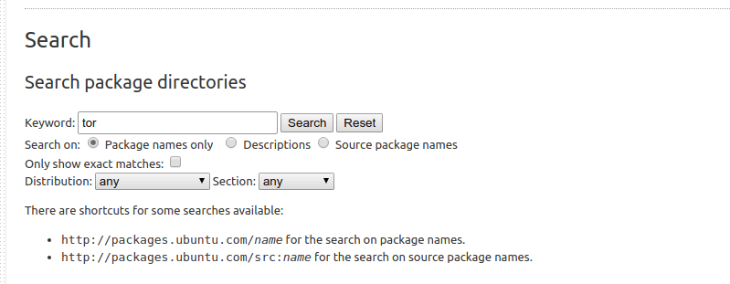
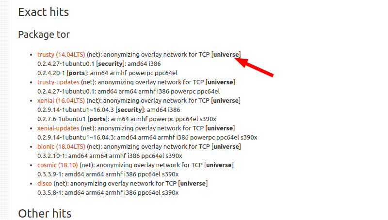

# What are Ubuntu Repositories? How to enable or disable them?
什么是 Ubuntu 软件仓库? 如何启用或禁用它们?

* https://itsfoss.com/ubuntu-repositories/

This detailed article tells you about various repositories like universe, multiverse in Ubuntu and how to enable or disable them.
本文详细介绍了 Ubuntu 中的各种软件仓库, 例如 universe 和 multiverse, 以及如何启用或禁用它们.

So, you are trying to follow a tutorial from the web and installing a software [using apt-get command](https://itsfoss.com/apt-get-linux-guide/)and it throws you the [unable to locate package error](https://itsfoss.com/unable-to-locate-package-error-ubuntu/):
所以, 你尝试按照网上教程[使用 apt-get 命令](https://itsfoss.com/apt-get-linux-guide/)安装软件, 但却遇到了 ["无法找到软件包"的错误](https://itsfoss.com/unable-to-locate-package-error-ubuntu/):

```bash
E: Unable to locate package xyz
```

You are surprised because the package should be available. You search on the internet and come across a solution that you have to enable universe or multiverse repository to install that package.
你感到很惊讶, 因为这个软件包应该已经存在了. 你在网上搜索, 找到一个解决方案: 需要启用 universe 或 multiverse 软件仓库才能安装该软件包.

You can enable universe and multiverse repositories in Ubuntu using the commands below:
您可以使用以下命令在 Ubuntu 中启用 universe 和 multiverse 软件仓库:

```bash
sudo add-apt-repository universe
sudo add-apt-repository multiverse
sudo apt update
```

You installed the universe and multiverse repository but do you know what are these repositories? How do they play a role in installing packages? Why are there several repositories?
您已经安装了 universe 和 multiverse 软件仓库, 但您知道这些软件仓库是什么吗? 它们在软件包安装过程中起什么作用? 为什么会有多个软件仓库?

I'll explain all these questions in detail here.
我将在这里详细解释所有这些问题.

## The concept of repositories in Ubuntu
Ubuntu 中的软件仓库概念

Okay, so you already know that to [install software in Ubuntu](https://itsfoss.com/remove-install-software-ubuntu/), you can use the [apt command](https://itsfoss.com/apt-command-guide/). This is the same [APT package manager](https://wiki.debian.org/Apt?ref=itsfoss.com)that Ubuntu Software Center utilizes underneath. So all the software (except Snap packages) that you see in the Software Center are basically from APT.
好的, 您应该已经知道, [在 Ubuntu 中安装软件](https://itsfoss.com/remove-install-software-ubuntu/)可以使用 [apt 命令](https://itsfoss.com/apt-command-guide/). Ubuntu 软件中心底层使用的也是 [APT 软件包管理器](https://wiki.debian.org/Apt?ref=itsfoss.com). 因此, 您在软件中心看到的所有软件(Snap 软件包除外)基本上都来自 APT.

Have you ever wondered where does the apt program install the programs from? How does it know which packages are available and which are not?
你有没有想过 apt 程序是从哪里安装程序的? 它是如何知道哪些软件包可用, 哪些不可用的?

Apt basically works on the repository. A repository is nothing but a server that contains a set of software. Ubuntu provides a set of repositories so that you won't have to search on the internet for the installation file of various software of your need. This centralized way of providing software is one of the main strong points of using Linux.
apt 的主要工作原理是依赖软件仓​​库. 软件仓库本质上就是一个包含软件集合的服务器. Ubuntu 提供了一系列软件仓库, 这样你就无需在互联网上搜索所需软件的安装文件. 这种集中式的软件提供方式是 Linux 的主要优势之一.

The APT package manager gets the repository information from the `/etc/apt/sources.list` file and files listed in `/etc/apt/sources.list.d` directory. Repository information is usually in the following format:
APT 软件包管理器从 /etc/apt/sources.list 文件和 /etc/apt/sources.list.d 目录中列出的文件获取软件源信息. 软件源信息通常采用以下格式:

```
deb http://us.archive.ubuntu.com/ubuntu/ bionic main
```

In fact, you can [go to the above server address](http://us.archive.ubuntu.com/ubuntu)and see how the repository is structured.
实际上, 您可以[访问上述服务器地址](http://us.archive.ubuntu.com/ubuntu), 查看存储库的结构.

When you [update Ubuntu using the apt update command](https://itsfoss.com/update-ubuntu/), the apt package manager gets the information about the available packages (and their version info) from the repositories and stores them in local cache. You can see this in `/var/lib/apt/lists` directory.
当您[使用 apt update 命令更新 Ubuntu](https://itsfoss.com/update-ubuntu/)时, apt 包管理器会从软件仓库获取可用软件包的信息(及其版本信息), 并将其存储在本地缓存中. 您可以在 /var/lib/apt/lists 目录中查看这些信息.

Keeping this information locally speeds up the search process because you don't have to go through the network and search the database of available packages just to check if a certain package is available or not.
将这些信息保存在本地可以加快搜索过程, 因为你无需通过网络搜索可用软件包数据库来检查某个软件包是否可用.

Now you know how repositories play an important role, let's see why there are several repositories provided by Ubuntu.
现在你知道软件仓库的重要性了, 让我们来看看为什么 Ubuntu 提供了多个软件仓库.

## Ubuntu Repositories: Main, Universe, Multiverse, Restricted and Partner
Ubuntu 软件仓库: 主软件仓库、Universe 软件仓库、Multiverse 软件仓库、Restricted 软件仓库和 Partner 软件仓库.


Software in Ubuntu repository are divided into five categories: main, universe, multiverse, restricted and partner.
Ubuntu 软件仓库中的软件分为五类: 主仓库、universe 仓库、multiverse 仓库、restricted 仓库和 partner 仓库.

Why Ubuntu does that? Why not put all the software into one single repository? To answer this question, let's see what are these repositories:
为什么 Ubuntu 会这样做? 为什么不把所有软件都放在一个单独的软件仓库里呢? 为了回答这个问题, 我们来看看这些软件仓库到底是什么:

### Main

When you install Ubuntu, this is the repository enabled by default. The main repository consists of only FOSS (free and open source software) that can be distributed freely without any restrictions.
安装 Ubuntu 时, 默认启用此软件仓库. 主软件仓库仅包含可以自由分发且没有任何限制的 FOSS(自由开源软件).

Software in this repository are fully supported by the Ubuntu developers. This is what Ubuntu will provide with security updates until your system reaches end of life.
本仓库中的软件均由 Ubuntu 开发人员提供全面支持. 在您的系统生命周期结束之前, Ubuntu 将为这些软件提供安全更新.

### Universe

This repository also consists free and open source software but Ubuntu doesn't guarantee of regular security updates to software in this category.
该软件仓库也包含自由开源软件, 但 Ubuntu 不保证定期为这类软件提供安全更新.

Software in this category are packaged and maintained by the community. The Universe repository has a vast amount of open source software and thus it enables you to have access to a huge number of software via apt package manager.
此类软件由社区打包和维护. Universe 软件仓库拥有海量的开源软件, 因此您可以通过 apt 包管理器访问大量软件.

### Multiverse

Multiverse contains the software that is not FOSS. Due to licensing and legal issues, Ubuntu cannot enable this repository by default and cannot provide fixes and updates.
Multiverse 包含非自由开源软件 (FOSS). 由于许可和法律问题, Ubuntu 无法默认启用此软件仓库, 也无法提供修复和更新.

It's up to you to decide if you want to use the Multiverse repository and check if you have the right to use the software.
是否使用 Multiverse 代码库以及是否拥有使用该软件的权利, 均由您自行决定.

### Restricted

Ubuntu tries to provide only free and open source software but that's not always possible specially when it comes to supporting hardware.
Ubuntu 尽量只提供免费和开源软件, 但这并非总是可行, 尤其是在支持硬件方面.

The restricted repositories consist of proprietary drivers.
受限存储库包含专有驱动程序.

### Partner

This repository consists of proprietary software packaged by Ubuntu for their partners. Earlier, Ubuntu used to provide Skype through this repository. This repository is going to be discontinued in the futire versions of Ubuntu as it moves towards snap packaging.
此软件仓库包含 Ubuntu 为其合作伙伴打包的专有软件. 此前, Ubuntu 曾通过此仓库提供 Skype. 随着 Ubuntu 向 snap 打包方式过渡, 此软件仓库将在未来的版本中停止使用.

### Third party repositories and PPA (Not provided by Ubuntu)
第三方软件仓库和 PPA(非 Ubuntu 提供)

The above five repositories are provided by Ubuntu. You can also [add third-party repositories](https://itsfoss.com/adding-external-repositories-ubuntu/)(it's up to you if you want to do it) to access more software or to access newer version of a software (as Ubuntu might provide old version of the same software).
以上五个软件仓库均由 Ubuntu 提供. 您也可以[添加第三方软件仓库](https://itsfoss.com/adding-external-repositories-ubuntu/)(是否添加取决于您), 以便访问更多软件或获取软件的更新版本(因为 Ubuntu 可能只提供同一软件的旧版本).

For example, if you add the repository provided by [VirtualBox](https://itsfoss.com/install-virtualbox-ubuntu/), you can get the latest version of VirtualBox. It will add a new entry in your sources.list.
例如, 如果您添加 [VirtualBox](https://itsfoss.com/install-virtualbox-ubuntu/)提供的软件源, 就可以获取最新版本的 VirtualBox. 这会在您的 sources.list 文件中添加一个新条目.

You can also install additional application using PPA (Personal Package Archive). I have written about [what is PPA and how it works](https://itsfoss.com/ppa-guide/)in detail so please read that article.
您还可以使用 PPA(个人软件包存档)安装其他应用程序. 我曾写过一篇[关于 PPA 及其工作原理](https://itsfoss.com/ppa-guide/)的详细文章, 请阅读该文章.

> Tip
> 提示
> Try NOT adding anything other than Ubuntu's repositories in your sources.list file. You should keep this file in pristine condition because if you mess it up, you won't be able to update your system or (sometimes) even install new packages.
> 请尽量不要在 sources.list 文件中添加除 Ubuntu 自带软件源之外的任何其他软件源. 务必保持此文件完整无误, 因为一旦出错, 您将无法更新系统, 甚至(有时)无法安装新软件包.

## Add universe, multiverse and other repositories
添加宇宙、多元宇宙和其他存储库

As of now, you should have the main, and universe repositories enabled by default. But, if you want to enable additional repositories through the terminal, here are the commands to do that:
目前, 主仓库和 universe 仓库应该默认启用. 但是, 如果您想通过终端启用其他仓库, 可以使用以下命令:

To enable Universe repository, use:
要启用 Universe 存储库, 请使用:

```bash
sudo add-apt-repository universe
```

To enable Restricted repository, use:
要启用受限存储库, 请使用:

```bash
sudo add-apt-repository restricted
```

To enable Multiverse repository, use this command:
要启用 Multiverse 存储库, 请使用以下命令:

```bash
sudo add-apt-repository multiverse
```

You must use sudo apt update command after adding the repository so that your system creates the local cache with package information.
添加软件源后, 必须使用 sudo apt update 命令, 以便系统创建包含软件包信息的本地缓存.

If you want to **remove a repository**, simply add -r like `sudo add-apt-repository-r universe`.
如果要**删除一个存储库** , 只需添加 -r, 例如 sudo add-apt-repository -r universe.

Graphically, go to Software & Updates and you can enable the repositories here:
在图形界面中, 转到"软件和更新", 您可以在此处启用存储库:



You'll find the option to enable the partner repository in the Other Software tab.
您可以在"其他软件"选项卡中找到启用合作伙伴存储库的选项.



To disable a repository, simply uncheck the box.
要禁用某个存储库, 只需取消选中该复选框即可.

## Bonus Tip: How to know which repository a package belongs to?
额外提示: 如何知道一个软件包属于哪个存储库?

Ubuntu has a dedicated website that provides you with information about all the packages available in the Ubuntu archive. Go to Ubuntu Packages website.
Ubuntu 有一个专门的网站, 提供 Ubuntu 软件仓库中所有软件包的信息. 请访问 Ubuntu 软件包网站.

[Ubuntu Packages  Ubuntu 软件包](https://packages.ubuntu.com/)

You can search for a package name in the search field. You can select if you are looking for a particular Ubuntu release or a particular repository. I prefer using ‘any' option in both fields.
您可以在搜索框中搜索软件包名称. 您可以选择要查找的特定 Ubuntu 版本或特定软件仓库. 我个人更喜欢在两个字段中都使用"任意"选项.



It will show you all the matching packages, Ubuntu releases and the repository information.
它会显示所有匹配的软件包、Ubuntu 版本和软件仓库信息.



As you can see above the package tor is available in the Universe repository for various Ubuntu releases.
如上所示, tor 软件包在 Universe 软件仓库中可用于各种 Ubuntu 版本.

## Conclusion
结论

I hope this article helped you in understanding the concept of repositories in Ubuntu.
希望这篇文章能帮助你理解 Ubuntu 中的软件仓库概念.

If you have any questions or suggestions, please feel free to leave a comment below. If you liked the article, please share it on social media sites like Reddit and Hacker News.
如果您有任何疑问或建议, 请在下方留言. 如果您喜欢这篇文章, 请在 Reddit 和 Hacker News 等社交媒体网站上分享.
