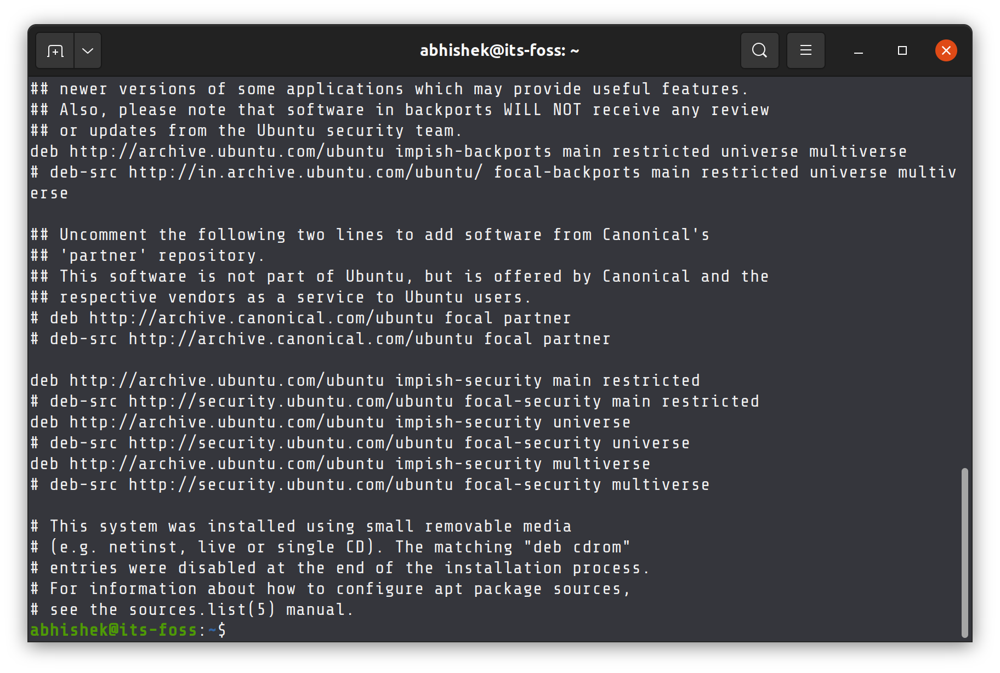
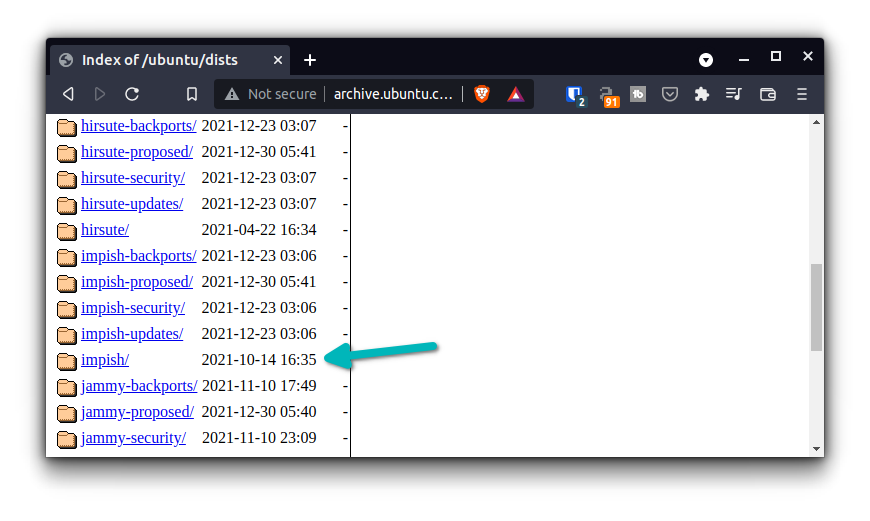
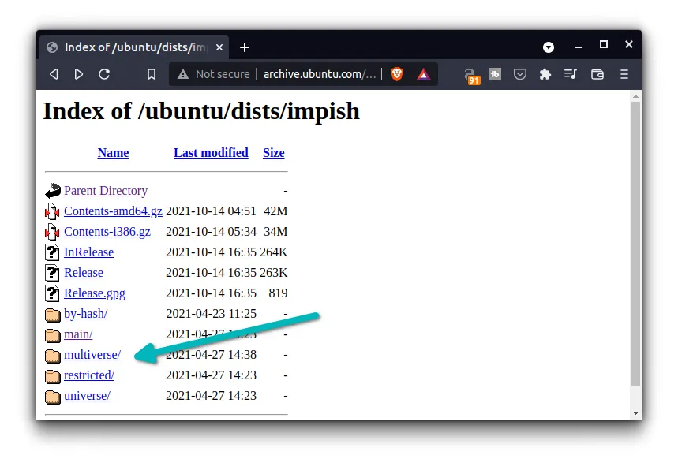
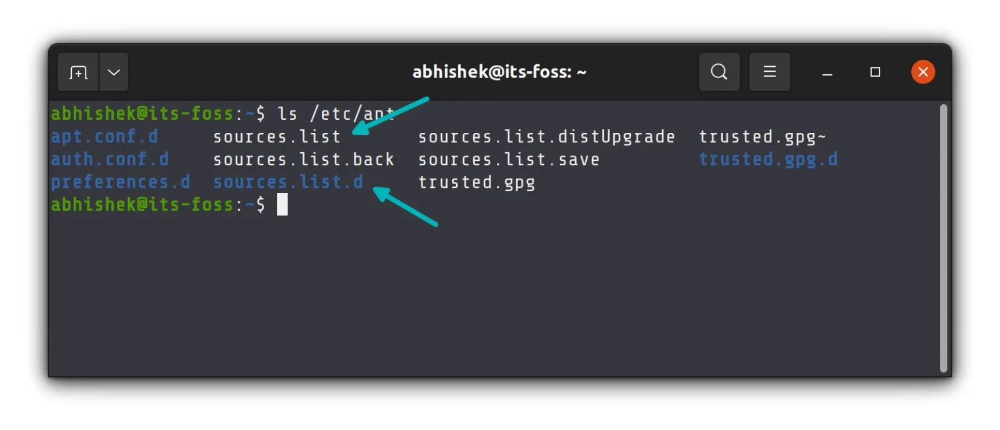
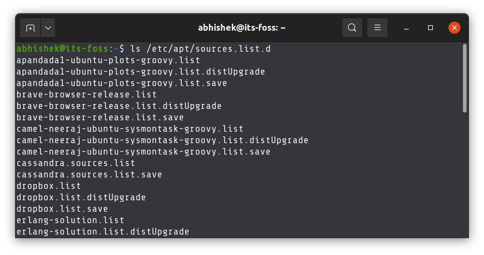
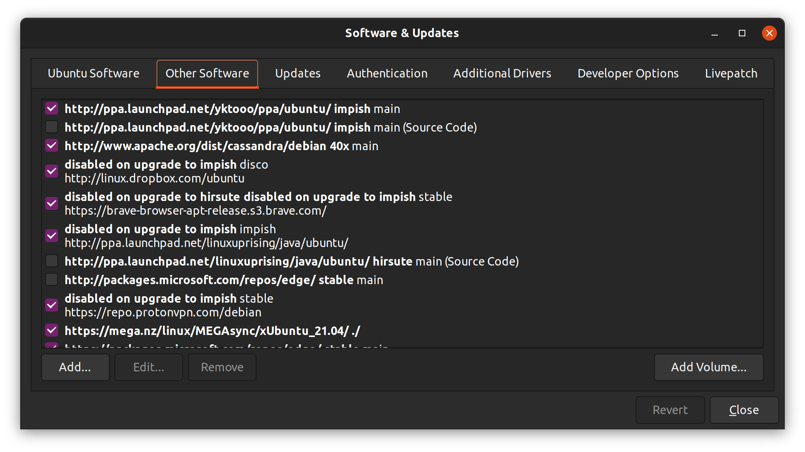

# Understanding sources.list in Ubuntu and Debian
了解 Ubuntu 和 Debian 中的 sources.list 文件

* https://itsfoss.com/sources-list-ubuntu/

Understanding the concept of sources.list in Ubuntu will help you understand and fix common update errors in Ubuntu.
了解 Ubuntu 中 sources.list 的概念将有助于您理解和修复 Ubuntu 中常见的更新错误.

I hope you are familiar with the [concept of package managers](https://itsfoss.com/package-manager/) and [repositories](https://itsfoss.com/ubuntu-repositories/).
我希望您熟悉[包管理器](https://itsfoss.com/package-manager/)和[软件仓库](https://itsfoss.com/ubuntu-repositories/)的概念.

A repository is basically a web server that has packages (software). The package manager gets these packages from the repositories.
软件仓库本质上是一个存放软件包(软件)的 Web 服务器. 软件包管理器从软件仓库获取这些软件包.

How does the apt package manager know the address of the repositories? The answer is sources.list file.
apt 包管理器是如何知道软件仓库地址的? 答案是 sources.list 文件.

## What does sources.list do?
sources.list 的作用是什么?

It's basically a text file that contains the repository details. Each uncommented line represents a separate repository.
它本质上是一个包含仓库详细信息的文本文件. 每一行未注释的内容代表一个单独的仓库.



The lines follow a specific format, though. It's usually composed of this:
这些行遵循特定的格式. 它通常由以下部分组成:

```bash
archive-type repository-url distribution component
```

I know that's not easy to understand. Let's take a look at one of the actual lines:
我知道这不容易理解. 我们来看其中一行:

```
deb http://archive.ubuntu.com/ubuntu impish main restricted
```

**Archive type is deb here**, meaning you'll get precompiled .deb packages. Another archive type is deb-src which provides the actual source code but usually it is commented out (not used by the system) because a regular user doesn't need the source code of an application. The deb file lets you install the package.
这里提供的归档类型是 deb, 这意味着您将获得预编译的 .deb 软件包. 另一种归档类型是 deb-src, 它提供实际的源代码, 但通常会被注释掉(系统不使用), 因为普通用户不需要应用程序的源代码. deb 文件允许您安装软件包.

**Repository URL is http://archive.ubuntu.com/ubuntu**. In fact, you can visit this URL and see various available folders (that contain the package details).
软件仓库网址是 http://archive.ubuntu.com/ubuntu. 实际上, 您可以访问此网址并查看各种可用的文件夹(其中包含软件包详细信息).

Next, the **distribution is impish**. On the actual repository, it is represented as **dists**. It's because there are several categories of repositories like impish-security (for security packages), impish-backports (for backported packages) etc. This is why it's not just the distribution name.
其次, **发行版是 impish**. 在实际的软件仓库中, 它被表示为 dists. 这是因为有多个类别的仓库, 例如 impish-security(用于安全软件包)、impish-backports(用于向后移植的软件包)等等. 这就是为什么它不仅仅是发行版的名称.

So, you can go to this URL `http://archive.ubuntu.com/ubuntu/dists/` and see that impish (codename for Ubuntu 21.10) is one of the available folders among many other choices here.
所以, 您可以访问此 URL http://archive.ubuntu.com/ubuntu/dists/, 并看到 impish(Ubuntu 21.10 的代号)是这里众多可用文件夹之一.



The component is one of the five types of [default Ubuntu repositories](https://itsfoss.com/ubuntu-repositories/).
该组件是 [Ubuntu 五种默认软件仓库](https://itsfoss.com/ubuntu-repositories/)类型之一.



You can combine more than one (if available) in the same line, actually. Instead of writing two lines like this:
实际上, 你可以在同一行中组合多个(如果可用)运算符. 例如, 不必像这样写两行:

```bash
deb http://archive.ubuntu.com/ubuntu impish main
deb http://archive.ubuntu.com/ubuntu impish restricted
```

You write two of them together like this:
你可以像这样把它们中的两个写在一起:

```
deb http://archive.ubuntu.com/ubuntu impish main restricted
```

This means when you have a repository detail like "deb http://archive.ubuntu.com/ubuntu impish main" in the sources.list, it gets software packages details stored at http://archive.ubuntu.com/ubuntu/dists/impish/main/
这意味着, 当 sources.list 中包含类似"deb http://archive.ubuntu.com/ubuntu impish main"这样的仓库详细信息时, 它会获取存储在 http://archive.ubuntu.com/ubuntu/dists/impish/main/ 的软件包详细信息.

### The distribution code name is important
分发代码名称很重要

Does this sound interesting? I bet it is.
听起来是不是很有趣? 我猜肯定很有趣.

Now imagine if someone is using an old, unsupported version of Ubuntu like Ubuntu 20.10 codenamed Groovy Gorilla.
现在想象一下, 如果有人正在使用像 Ubuntu 20.10(代号 Groovy Gorilla)这样老旧且不受支持的 Ubuntu 版本.

The sources.list file will contain repository URL like `deb http://archive.ubuntu.com/ubuntu groovy main`. And then it becomes problematic because if you visit `http://archive.ubuntu.com/ubuntu/dists` URL, you won't find groovy folder here. Since Ubuntu 20.10 is no longer maintained, its folder has been removed.
sources.list 文件会包含类似 `deb http://archive.ubuntu.com/ubuntu groovy main` 的仓库 URL. 这样就会出现问题, 因为如果您访问 `http://archive.ubuntu.com/ubuntu/dists` URL, 将找不到 groovy 文件夹. 由于 Ubuntu 20.10 已停止维护, 其 groovy 文件夹已被移除.

As a result, Ubuntu will show an error like '[release file not found](https://itsfoss.com/repository-does-not-have-release-file-error-ubuntu/)' or 'error 404 repository not found'.
因此, Ubuntu 将显示类似 "[找不到发布文件](https://itsfoss.com/repository-does-not-have-release-file-error-ubuntu/)" 或 "找不到 404 错误存储库"的错误.

Did you notice that my sources.list file had some entries with focal (Ubuntu 20.04)? It's because I had upgraded my Ubuntu 20.04 system to 20.10 to 21.04 and now to 21.10.
你注意到我的 sources.list 文件中有一些包含 focal (Ubuntu 20.04) 的条目吗? 这是因为我把 Ubuntu 20.04 系统升级到了 20.10, 再到 21.04, 现在又升级到了 21.10.

## sources.list file and sources.list.d directory
sources.list 文件和 sources.list.d 目录

If you look at the /etc/apt directory, you'll notice a directory called sources.list.d.
如果你查看 /etc/apt 目录, 你会注意到一个名为 sources.list.d 的目录.



The idea is that the primary sources.list file is for the official Ubuntu repositories and for any external repositories and PPA, you add a .list file (with the repository details) in this sources.list.d directory.
其理念是, 主要的 sources.list 文件用于官方的 Ubuntu 软件仓库, 对于任何外部软件仓库和 PPA, 您都可以在 sources.list.d 目录中添加一个 .list 文件(包含软件仓库的详细信息).



This makes managing the repositories easier as you don't mess up with the default repositories. The external repositories can be easily disabled (by adding # in front of the repository details) or removed (by removing its corresponding .list file).
这样可以简化仓库管理, 因为您无需修改​​默认仓库. 外部仓库可以轻松禁用(在仓库详细信息前添加 #)或删除(删除其对应的 .list 文件).

You can use the graphical Software & Updates tool for the same purpose if you use Ubuntu desktop. The entries in 'Ubuntu Software' tab come from the sources.list file and the entries in the 'Other Software' tab come from the files in sources.list.d directory.
如果您使用的是 Ubuntu 桌面系统, 可以使用图形化的"软件和更新"工具来实现相同的目的. "Ubuntu 软件"选项卡中的条目来自 sources.list 文件, "其他软件"选项卡中的条目来自 sources.list.d 目录中的文件.



## The next step
下一步

Is that clear so far? You have learned plenty of 'behind the curtains'things.
到目前为止都明白了吗? 你已经了解了很多"幕后"的事情.

If the entries in sources.list are incorrect or duplicated, your system will throw errors when you [try to update your Ubuntu system](https://itsfoss.com/update-ubuntu/).
如果 sources.list 中的条目不正确或重复, 则在[尝试更新 Ubuntu 系统](https://itsfoss.com/update-ubuntu/)时, 系统将抛出错误.

As you are familiar with the concept of package management, repository and sources.list, understanding the root cause and [fixing the common update errors in Ubuntu](https://itsfoss.com/ubuntu-update-error/) becomes an easier task.
由于您熟悉软件包管理、存储库和 sources.list 的概念, 因此了解 [Ubuntu 中常见更新错误的根本原因并修复它们](https://itsfoss.com/ubuntu-update-error/)就变得更容易了.
